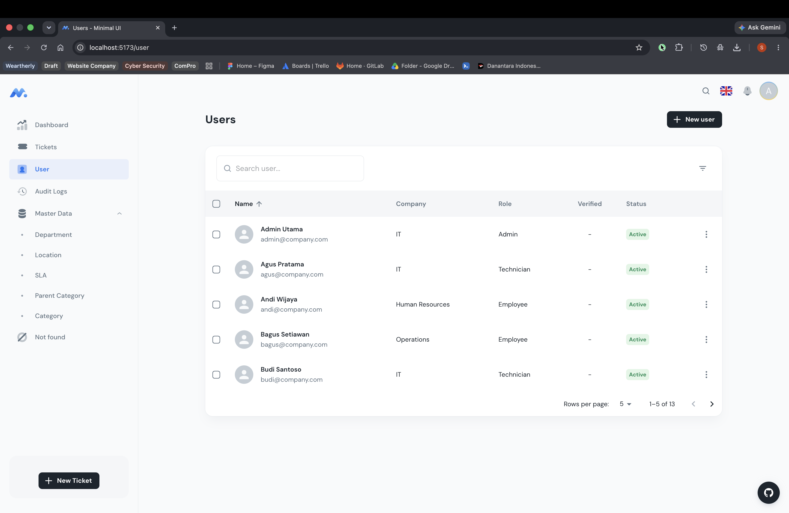
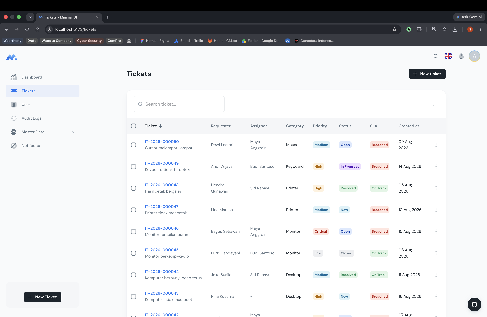
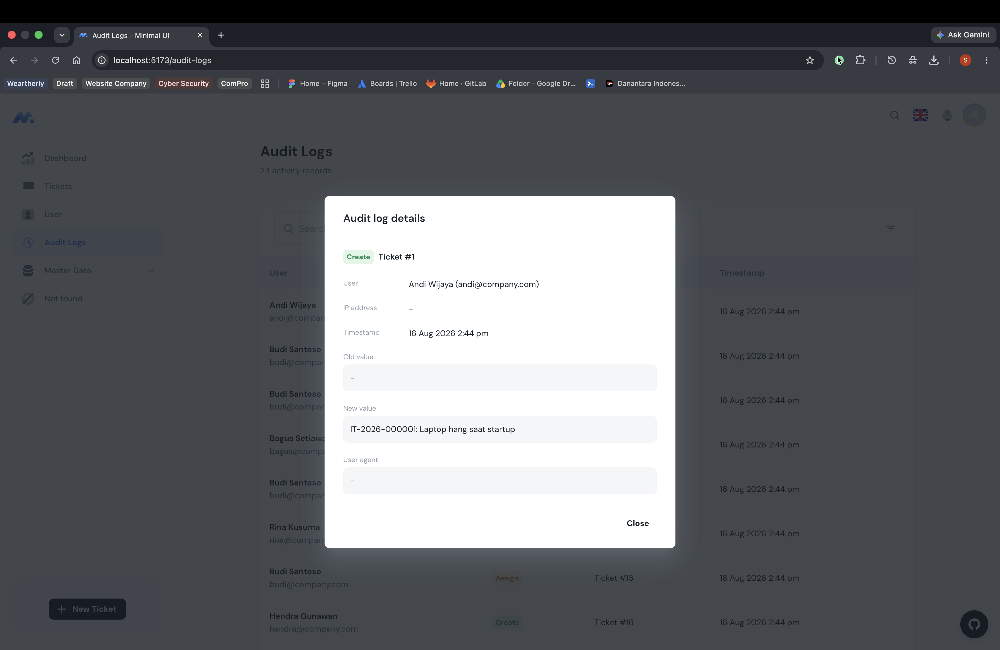
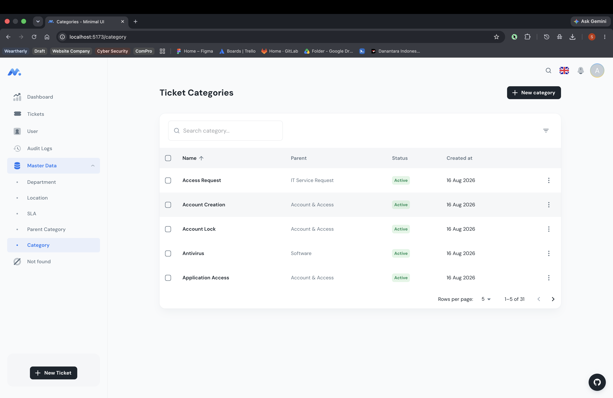
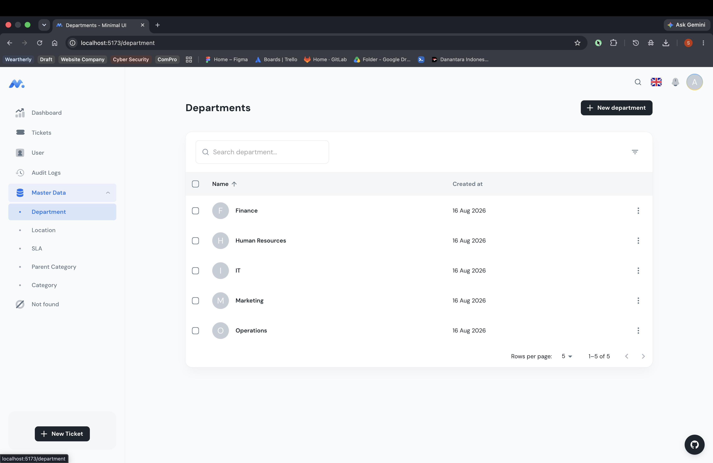
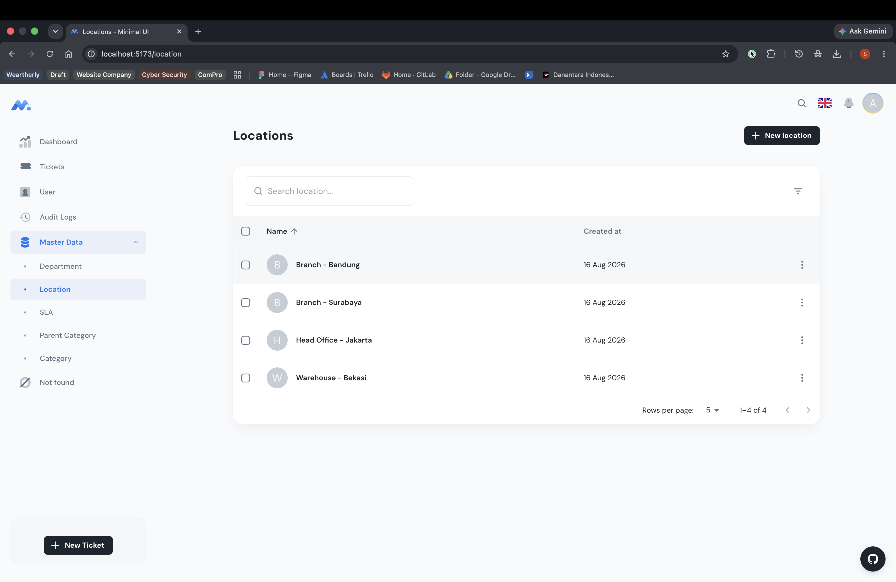
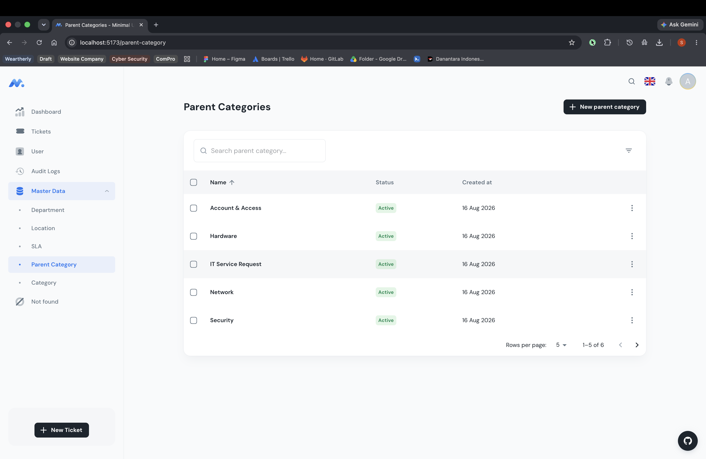
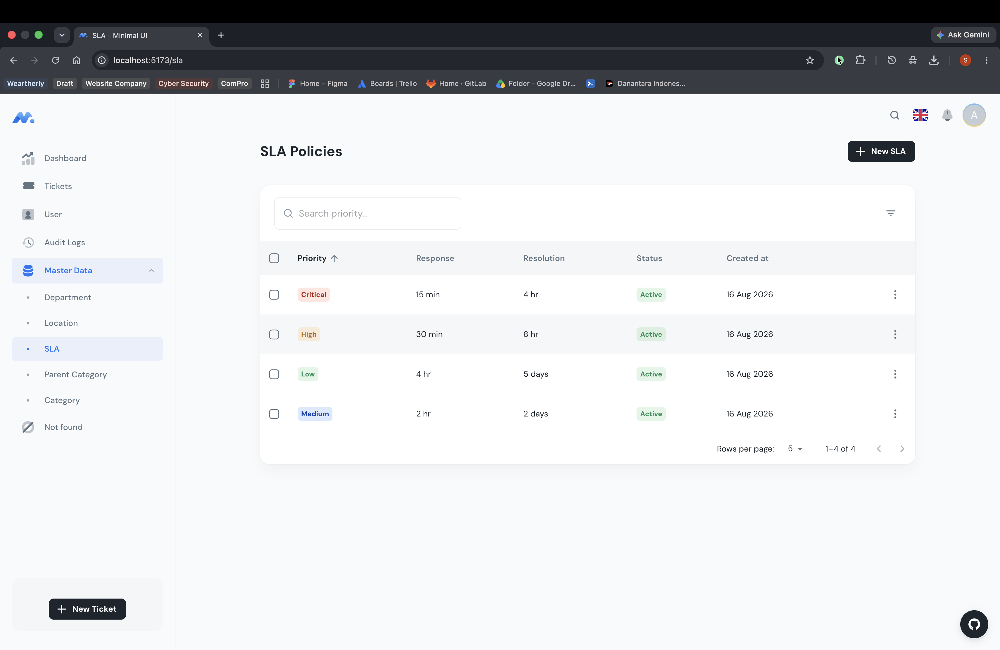
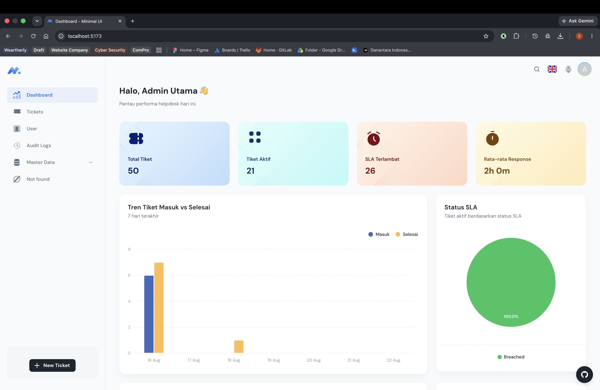

# Ticketing System

IT Helpdesk / Ticketing System - Full stack application for managing internal support tickets.

---

## 📦 Tech Stack

### Backend

- **Runtime:** Node.js 20 (Alpine)
- **Framework:** Express.js
- **Language:** TypeScript
- **ORM:** Drizzle ORM
- **Database:** PostgreSQL
- **Authentication:** JSON Web Tokens (jwt), Bcryptjs
- **Security:** Helmet, CORS, Rate Limiting
- **Utilities:** Multer (file uploads), Winston (logging), Zod (validation)

### Frontend

- **Framework:** React 19 + Vite
- **Language:** TypeScript
- **UI Library:** Material UI (MUI) v7
- **Charts:** ApexCharts + react-apexcharts
- **Routing:** React Router DOM
- **State:** Context API (Auth theme provider)

### DevOps

- **Containerization:** Docker + Docker Compose
- **Orchestration:** 3 services (db, backend, frontend)

---

## ✨ Features

### Authentication


- Login / Logout with JWT access tokens
- Session management with `me` endpoint
- Account activation status check
- Role-based access control (ADMIN, TECHNICIAN, EMPLOYEE)

### Ticket Management


- Create tickets with auto-generated ticket numbers
- SLA response/deadline calculation based on priority
- Status workflow with valid transitions (NEW → OPEN → IN_PROGRESS → PENDING → RESOLVED → CLOSED)
- Priority levels: LOW, MEDIUM, HIGH, CRITICAL
- Search and filter by status, priority, category, department, location
- Pagination support
- Ticket comments (internal/external)
- File attachments (up to 10 files per ticket)
- Ticket assignment to technicians (admin/technician only)
- Status change with transition validation


- Audit logging for all ticket actions

### Reference Data

   
- Category & Parent Category management
- Department management
- Location management
- SLA policy configuration



### Dashboard & Reporting


- Ticket statistics and charts
- Real-time status overview
- Activity tracking

### Notifications

- Automated notifications for ticket creation, comments, status changes
- Notification targeting based on user roles

### File Uploads

- Attachment support with storage in database
- MIME type and size validation

---

## 🏗️ Architecture

```text
┌─────────────────┐      HTTPS      ┌────────────────────┐
│   Frontend      │ ──────────────▶ │   Backend API      │
│   (React + Vite)│              │   (Express + TS)   │
└─────────────────┘              └────────────────────┘
                                       │
                                       │
                                       ▼
                              ┌─────────────────┐
                              │   PostgreSQL    │
                              │   (Docker volume)│
                              └─────────────────┘
```

- **Client-Server architecture** with RESTful API
- **Express** routes organized by feature (`/api/*`)
- **Middleware stack**: request logger → helmet → CORS → rate limit → route handlers
- **Auth middleware**: JWT verification + role authorization
- **Drizzle ORM** for type-safe database queries
- **Docker Compose** for local development (db + backend + frontend)

---

## 🐳 Installation with Docker

### Prerequisites

- Docker and Docker Compose

### Steps

```bash
# 1. Clone the repository
git clone <repository-url>
cd ticketing_system

# 2. Start all services
docker-compose up -d

# 3. Wait for the database to be ready
# The backend will automatically run migrations on first start

# 4. Access the application
# - Frontend: http://localhost:5173 (via nginx on port 80)
# - Backend API: http://localhost:4213/api/*
# - Health check: http://localhost:4213/api/health
# - PostgreSQL: localhost:5433 (mapped from container 5432)
```

### Docker Services

| Service | Ports | Description |
|---------|-------|-------------|
| `db` | 5433:5432 | PostgreSQL database |
| `backend` | 4213:4213 | Node.js Express API |
| `frontend` | 5173:80 | React app served via Nginx |

### Environment Variables

The backend reads from `./backend/.env`. A sample is provided:

```bash
cp backend/.env.example backend/.env
# Edit values as needed (DATABASE_URL, JWT_SECRET, etc.)
```

The frontend reads `VITE_API_URL` from `frontend/.env.example` (defaults to `/api`).

### Volumes

- `ticketing_system_pgdata` - PostgreSQL data persistence

---

## 🔧 Installation without Docker

### Prerequisites

- Node.js 20+
- PostgreSQL 16+
- yarn or npm

### Backend Setup

```bash
# 1. Install dependencies
cd backend
npm install

# 2. Configure environment
cp .env.example .env
# Edit .env with your PostgreSQL connection details

# 3. Run database migrations
npm run db:migrate
# Or generate schema if needed:
npm run db:generate

# 4. Seed initial data (optional)
npm run db:seed

# 5. Start the development server
npm run dev
# Server runs on http://localhost:4213
```

### Frontend Setup

```bash
# 1. Install dependencies
cd frontend
npm install

# 2. Configure API endpoint
# VITE_API_URL in .env.example defaults to /api
# The dev server proxies to http://localhost:4213/api

# 3. Start the development server
npm run dev
# App runs on http://localhost:5173
```

### Production Build

```bash
# Backend
cd backend
npm run build
npm run start

# Frontend
cd frontend
npm run build
# Output goes to dist/
```

---

## 🗄️ Database Migrations

The project uses Drizzle Kit for migrations:

```bash
# Generate migration from schema changes
npm run db:generate

# Apply migrations to database
npm run db:migrate

# Push schema without migration tracking
npm run db:push
```

---

## 🌐 API Endpoints (Summary)

### Auth

- `POST /api/auth/login` - Authenticate user
- `POST /api/auth/logout` - Revoke token
- `GET /api/auth/me` - Get current user profile

### Users

- `GET /api/users` - List users (admin only)

### Tickets (main feature)

| Endpoint | Description |
|---|---|
| `GET /api/tickets` | List tickets with filters & pagination |
| `POST /api/tickets` | Create new ticket |
| `GET /api/tickets/:id` | Get ticket by ID |
| `PATCH /api/tickets/:id` | Update ticket |
| `DELETE /api/tickets/:id` | Delete ticket (admin/new owner) |
| `POST /api/tickets/:id/comments` | Add comment |
| `POST /api/tickets/:id/assign` | Assign to technician |
| `POST /api/tickets/:id/status` | Change status |
| `POST /api/tickets/:id/attachments` | Upload files |

### Reference Data

- `GET /api/categories` - List categories
- `GET /api/parent-categories` - List parent categories
- `GET /api/departments` - List departments
- `GET /api/locations` - List locations
- `GET /api/sla` - SLA policies

### Dashboard

- `GET /api/dashboard/statistics` - Get stats

### Notifications & Audit

- `GET /api/notifications` - List user notifications
- `GET /api/audit-logs` - Audit trail (admin only)